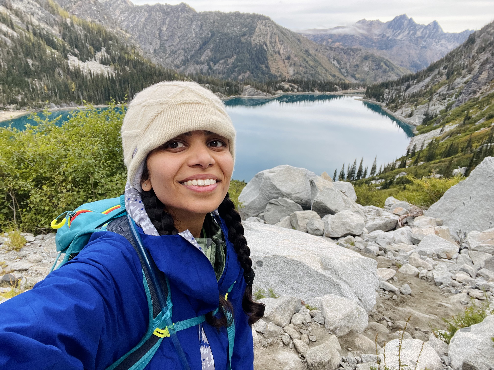
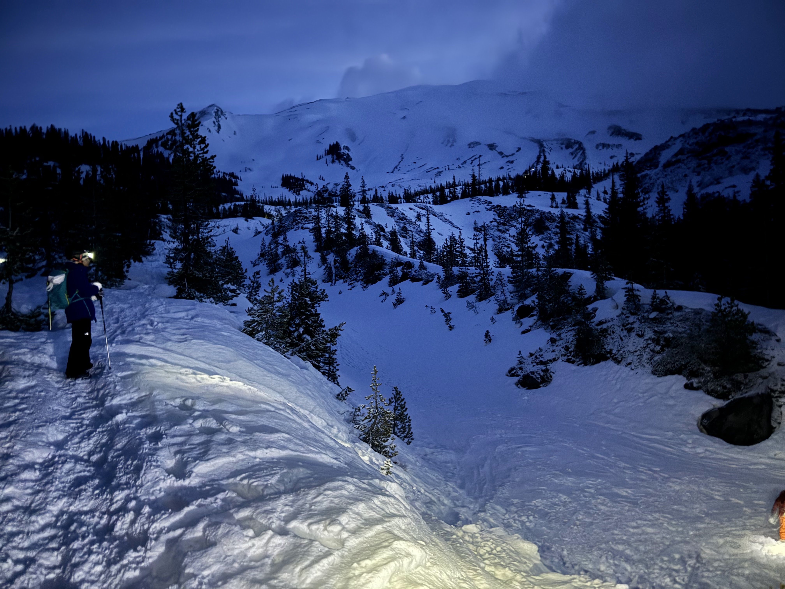

# Pooja Singh

  
       
  

## Full Stack Software Engineer

📍 Seattle, Washington | 📧 [singhpoo@usc.edu](mailto:singhpoo@usc.edu) | 🔗 [LinkedIn](https://www.linkedin.com/in/singhpoo/)

---

### About Me

Hi there! I’m a Full Stack Software Engineer with over 7 years of experience building tools and systems that make life easier for users and teams alike. My work has spanned frontend and backend development, cloud technologies, AI/ML integrations, and mentoring the next generation of developers. I thrive on collaboration and love turning complex ideas into efficient, user-friendly solutions.

---
### Recent Projects with LLMs

### LLM Gateway
Currently working on building an open-source custom **AI gateway** that integrated OpenAI, Anthropic's Claude, and Google's Gemini models. This project focuses on effective cost management while implementing fallback mechanisms and caching strategies, streamlining AI integrations for developers and businesses.

### MIDI generator
Built an app that allows users to compose multi-track midi music using advanced Language Models (LLMs). Utilizing **TypeScript** and deploying it on **Vercel**, I created a platform where anyone can easily turn their ideas into musical compositions.

### SoulSync Chatbot
Developed a therapy chatbot designed to provide support through advanced prompting techniques and automated evaluation systems. This project aimed to create a safe and engaging space for users to express their thoughts and feelings, making mental health resources more accessible.

### Learning Assistant
Created a **Learning Assistant** that combined a comprehensive database of course materials with **Retrieval-Augmented Generation (RAG)**. This tool offered an interactive learning experience, enabling users to explore any subject dynamically as if they had a personal tutor at their fingertips.

---

### Career Journey

#### Software Development Engineer 2, Microsoft
*Redmond | Feb 2020 - Present*

**Azure Analytics - Lens Explorer**
- Developed features for Lens Explorer, a data analysis and visualization service
- Contributed to Orchestrator UX for executing scripts and managing data workflows
- Built robust test infrastructure and promoted testing culture across the team
- Led adoption of Azure Managed Grafana for dashboards and visualizations
- Enhanced ElixirFX, an internal design framework

**Azure Monitor -- Data Collection Rules**
- Redesigned and migrated Azure Monitor's Data Collection module from KnockoutJS to React
- Developed and optimized Data Collection Rules
- Improved customer satisfaction metrics through streamlined workflows

#### Sr. Software Engineer, Visa Inc
*Denver | March 2018 - Feb 2020*

**Infrastructure Architecture & Engineering**
- Supported Visa's Continuous Availability Program
- Enhanced high availability and fast failover capabilities
- Developed proprietary system for measuring and automating critical processes
- Implemented and managed Central Infrastructure Service Request Portal and IT Disaster Recovery portal

**Tech Strategy, Governance & Disaster Recovery**
- Contributed to re-engineering Visa's Technology Governance program
- Automated technological governance workflows
- Built and optimized features within the Technology Governance Portal

#### Software Engineer Intern, Visa Inc
*Denver | May 2017 - Aug 2017*
- Designed and developed Data Integrity dashboards for Visa's Disaster Recovery Team
- Automated IT Disaster Recovery exercise workflows
- Built Service Impact Assessment (SIA) tool

#### Software Engineer, Capgemini Technology Services
*Bangalore, India | June 2015 - June 2016*
- Automated CI/CD pipelines using AWS, Azure, Chef, and Puppet
- Designed client cloud architectures and facilitated migrations
---

### Education

- **M.S. in Computer Science**, University of Southern California, 2018  
- **B.E. in Computer Science**, Visvesvaraya Technological University, 2015  

---

Feel free to reach out or connect—I’m always up for collaborating on exciting projects or just chatting about tech and creativity!
